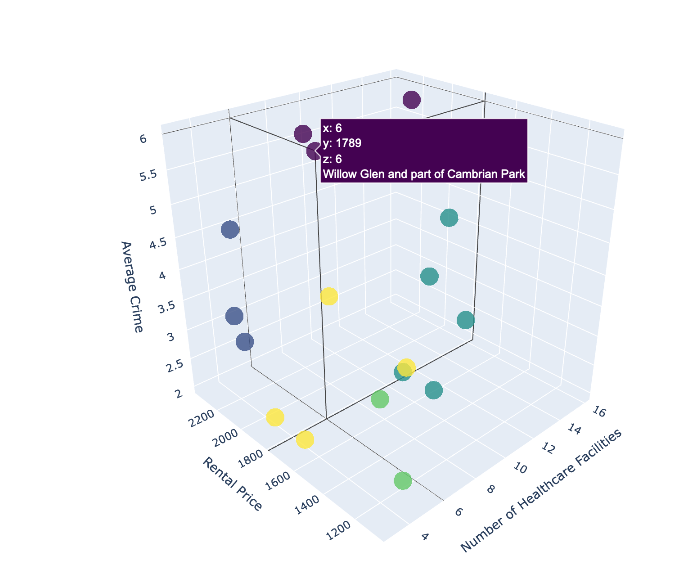
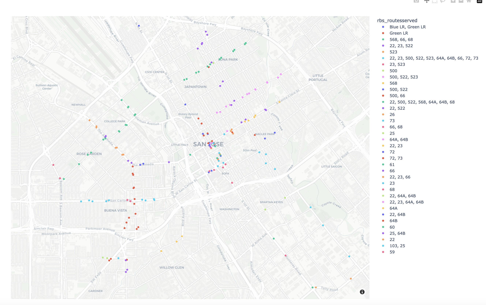

Ashkan Nikfarjam Project
Background:
Due to rising cost of living in the bay area, students are among the group that get effected by this fact. As a San Jose State University student, in this project, I am analyzing  data about San Jose Neighborhood, and use Machine Learning and a recomendation engine to identify and recomend set of neighborhoods tailored to the students needs. 

Martinez and etal, identified the neads of students as offordable housing, access to public transportation, adequate healthcare facility, and safety as their assencial needs(doi:10.1177/0890117121992295). 

In mt project I collected data from San Jose Open Portal and apartments.com API to extract and manipulate data. I used Kmean Clustering to classify, which a unsupervised Model that would help me classify the neighborhood by clustering them based on the features.  

## model selection

After preprocessing data and gaining insight about the correlation between each data, the next task is to find an appropriate model to make classification optimal. they vary on performance and how data should be prepared for them. For the purpose of this proposal, the performance of  KNearest Neighbors (KNN), K Mean Clustering, and Hirecial Clustering is compared

 

From the conducted comparison analysis, it could be deduced that K Means Clustering outperforms the other models.

## sj classified neighborhood

Through my analysis I am also going to show some visuals such as graphs and tables to gain insightful results

Ex: Using extracted data about Public Transportation, I created this map that show all the available form of Public Transportation such as busses, LightRail, and so on, that passes through the schools.

Library used:

Geopy

Pandas

Plotly

SciKit Learn

tqdm

This Project is still in progress!